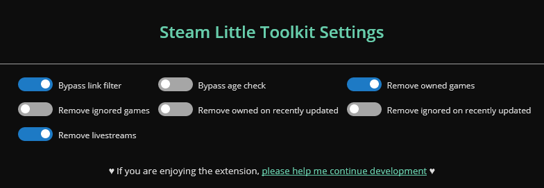
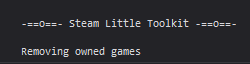

# Steam Little Toolkit browser extension
Tweaks the Steam store to make it a better experience

Works best with the [SteamDB Extension](https://steamdb.info/extension/)!

Find all the utilites by reading the settings!

**Download the script for [Mozilla Firefox](https://addons.mozilla.org/en-US/firefox/addon/steam-little-toolkit/) or for [Google Chrome](https://chrome.google.com/webstore/detail/steam-little-toolkit/pnhdnmabfhccfeopkagnbddebnkamkfk?hl=es)**


## Images

The graphical menu


Console Notifications



## List of features
- [x] Remove live streams on steam store
- [x] Remove owned/ignored games on the steam store
- [x] Remove owned/ignored games on the *recently updated* list
- [x] Bypass age check
- [x] Bypass external link filter
- [x] Graphical menu for toggling all the settings
- [x] Sync settings between devices
- [x] Transform the script to a browser extension
- [x] Doesnt load if a secure page is loaded (cart, login, etc.)

## To do
- [ ] Remove games when an event happens, not every **x** seconds
- [ ] Option to ignore owned/ignored games while viewing bundles
- [ ] Option to pause livestreams instead of deleting them
- [ ] If a setting is added, add it to the current menu instead of replacing to the default one
- [ ] Add OS notifications for when the settings are replaced by the default ones
- [ ] Add toggle to disable the beg for money
- [ ] Inject HTML code with javascript and not unsafe variables
- [ ] Welcome page or settings page when installed
- [ ] If failing to achieve the event-driven removing, have a slider for the seconds between removes
- [ ] Recolect stats 


### Completed

- [x] Fix owned/ignored games being deleted from search results
- [x] On the comment section while viewing a game, automatically click "your languages" (Added very poorly but added it)
- [x] Implement a colorful way to log messages to console
- [x] Better description of the settings on hovering
- [x] Make a script with web-ext that automatically zips the src and dist folder and uploads them to AMO
- [x] Tweak the CSS so the transition to Chrome extension is easier
- [x] Publish on https://addons.mozilla.org/
- [x] Publish on https://chrome.google.com/webstore/category/extensions


## Web-Ext
Browser development
```
npm install -g web-ext
web-ext lint --source-dir=src
web-ext run --firefox="C:\Program Files\Firefox Developer Edition\firefox.exe" --firefox-profile=default --source-dir=src
```

## Gulp
Final build
```
npm install
npx gulp build
```

## Publishing
Build on windows 10 with
```
.\scripts\buildDist.ps1
.\scripts\buildSrc.ps1
```

Maybe you'll need to execute this before
```
Get-ExecutionPolicy
Set-ExecutionPolicy Unrestricted
```